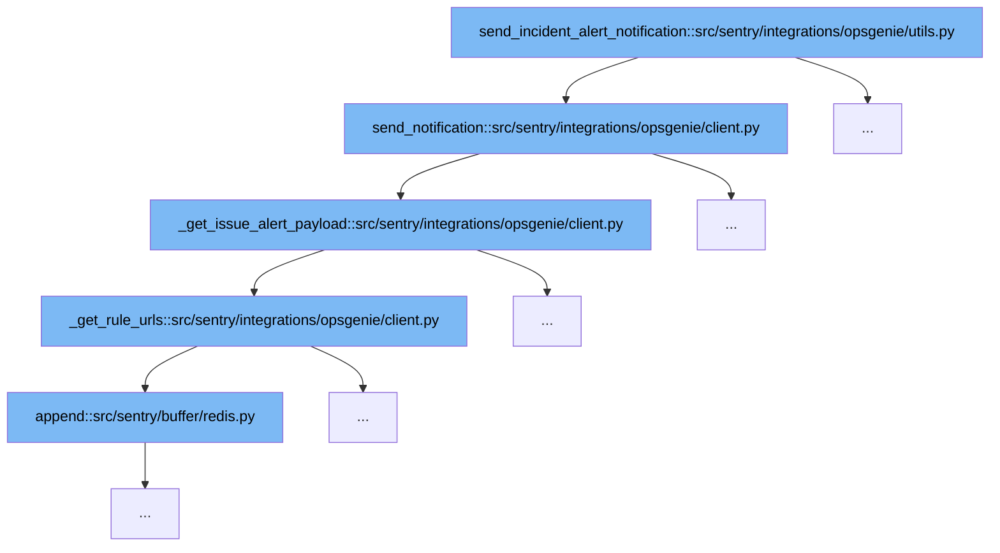

This document outlines the flow of sending incident alert notifications to Opsgenie within the Sentry application. It will cover the following steps:

1. Initiating the notification process.
2. Constructing the notification payload.
3. Generating URLs for triggered rules.
4. Appending data to Redis.



<SwmSnippet path="/src/sentry/integrations/opsgenie/utils.py" line="1">

---

# Initiating the Notification Process

The function `send_incident_alert_notification` initiates the process of sending an alert notification to Opsgenie. It serves as the entry point for the notification flow, preparing and delegating the data handling to `send_notification`.

```python
from __future__ import annotations
```

---

</SwmSnippet>

<SwmSnippet path="/src/sentry/integrations/opsgenie/client.py" line="52">

---

# Constructing the Notification Payload

The function `_get_issue_alert_payload` constructs the payload for the Opsgenie notification. It includes details such as the event message, source, priority, and tags, which are crucial for Opsgenie to process and display the alert correctly.

```python
    def _get_issue_alert_payload(
        self,
        data,
        rules,
        event: Event | GroupEvent,
        group: Group | None,
        priority: OpsgeniePriority | None = "P3",
        notification_uuid: str | None = None,
    ):
        payload = {
            "message": event.message or event.title,
            "source": "Sentry",
            "priority": priority,
            "details": {
                "Triggering Rules": ", ".join([rule.label for rule in rules]),
                "Release": data.release,
            },
            "tags": [f'{str(x).replace(",", "")}:{str(y).replace(",", "")}' for x, y in event.tags],
        }
        if group:
            rule_urls = self._get_rule_urls(group, rules)
```

---

</SwmSnippet>

<SwmSnippet path="/src/sentry/integrations/opsgenie/client.py" line="44">

---

# Generating URLs for Triggered Rules

The function `_get_rule_urls` generates URLs for each rule that triggered the alert. These URLs are included in the notification payload to provide quick access to the rule details directly from the Opsgenie alert.

```python
    def _get_rule_urls(self, group, rules):
        organization = group.project.organization
        rule_urls = []
        for rule in rules:
            path = f"/organizations/{organization.slug}/alerts/rules/{group.project.slug}/{rule.id}/details/"
            rule_urls.append(organization.absolute_url(path))
        return rule_urls
```

---

</SwmSnippet>

<SwmSnippet path="/src/sentry/buffer/redis.py" line="1">

---

# Appending Data to Redis

The `append` function in `redis.py` is used to append data related to the alert into Redis. This step is crucial for maintaining state and ensuring that alert data is available for further processing or future reference.

```python
from __future__ import annotations
```

---

</SwmSnippet>

&nbsp;

*This is an auto-generated document by Swimm AI 🌊 and has not yet been verified by a human*

<SwmMeta version="3.0.0" repo-id="Z2l0aHViJTNBJTNBc2VudHJ5JTNBJTNBZ2V0c2VudHJ5" repo-name="sentry"><sup>Powered by [Swimm](/)</sup></SwmMeta>
