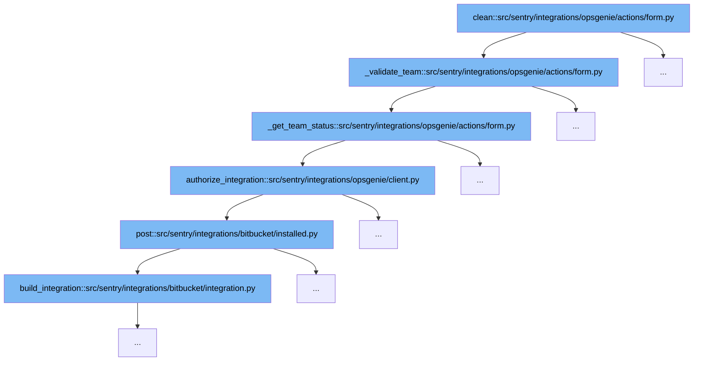

This document outlines the flow of validating and authorizing Opsgenie integration in Sentry. The flow ensures that the team and API key provided are valid within the context of the specified Opsgenie account. Here's what we'll cover:

1. Initial validation of team and integration existence.
2. Checking the team status and API key validity.
3. Authorization of the integration based on the API key.



<SwmSnippet path="/src/sentry/integrations/opsgenie/actions/form.py" line="85">

---

# Initial Validation

The `_validate_team` function starts by checking if the specified Opsgenie integration and team exist in Sentry's records. If either does not exist, it raises a validation error, preventing any further actions.

```python
    def _validate_team(self, team_id: str | None, integration_id: int | None) -> None:
        params = {
            "account": dict(self.fields["account"].choices).get(integration_id),
            "team": dict(self.fields["team"].choices).get(team_id),
        }
        integration = integration_service.get_integration(
            integration_id=integration_id, provider="opsgenie"
        )
        org_integration = integration_service.get_organization_integration(
            integration_id=integration_id,
            organization_id=self.org_id,
        )
        if integration is None or org_integration is None:
            raise forms.ValidationError(
                _("The Opsgenie integration does not exist."),
                code="invalid_integration",
                params=params,
            )
```

---

</SwmSnippet>

<SwmSnippet path="/src/sentry/integrations/opsgenie/actions/form.py" line="59">

---

# Team Status and API Key Validation

The `_get_team_status` function further validates the team by checking its existence and the validity of the API key associated with the team. If the team does not exist or the API key is invalid, appropriate errors are raised.

```python
    def _get_team_status(
        self,
        team_id: str | None,
        integration: RpcIntegration,
        org_integration: RpcOrganizationIntegration,
    ) -> int:
        team = get_team(team_id, org_integration)
        if not team or not team_id:
            return INVALID_TEAM

        install = cast(
            "OpsgenieIntegration",
            integration.get_installation(organization_id=org_integration.organization_id),
        )
        client = install.get_keyring_client(keyid=team_id)
        # the integration should be of type "sentry"
        # there's no way to authenticate that a key is an integration key
        # without specifying the type... even though the type is arbitrary
        # and all integration keys do the same thing
        try:
            client.authorize_integration(type="sentry")
```

---

</SwmSnippet>

<SwmSnippet path="/src/sentry/integrations/opsgenie/client.py" line="39">

---

# Authorization of Integration

Once the team and API key are validated, the `authorize_integration` function is called to authorize the integration with Opsgenie. This step ensures that the integration is allowed to proceed with the provided credentials.

```python
    def authorize_integration(self, type: str) -> BaseApiResponseX:
        body = {"type": type}
        path = "/integrations/authenticate"
        return self.post(path=path, headers=self._get_auth_headers(), data=body)
```

---

</SwmSnippet>

&nbsp;

*This is an auto-generated document by Swimm AI 🌊 and has not yet been verified by a human*

<SwmMeta version="3.0.0" repo-id="Z2l0aHViJTNBJTNBc2VudHJ5JTNBJTNBZ2V0c2VudHJ5" repo-name="sentry"><sup>Powered by [Swimm](/)</sup></SwmMeta>
