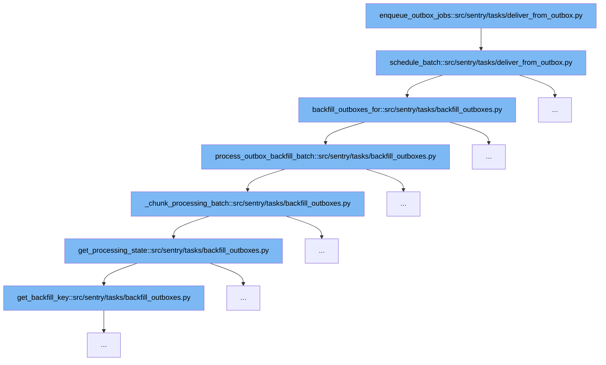

This document will explore the function `enqueue_outbox_jobs` and its role in the task scheduling system within Sentry. We'll cover:

1. The initiation of the outbox job queue.
2. Scheduling batches for processing.
3. Handling backfill operations for outboxes.
4. Processing individual backfill batches.
5. Managing chunk processing in batches.
6. Retrieving and setting processing states.



<SwmSnippet path="/src/sentry/tasks/deliver_from_outbox.py" line="58">

---

# Initiation of Outbox Job Queue

The function `enqueue_outbox_jobs` initiates the job queue for outbox tasks. It sets up the environment and parameters needed for the batch processing of outbox jobs, including concurrency and processing flags.

```python
def schedule_batch(
    silo_mode: SiloMode,
    drain_task: Task,
    concurrency: int | None = None,
    process_outbox_backfills=True,
) -> None:
    scheduled_count = 0

    if not concurrency:
        concurrency = CONCURRENCY
    try:
        for outbox_name in settings.SENTRY_OUTBOX_MODELS[silo_mode.name]:
            outbox_model: type[OutboxBase] = OutboxBase.from_outbox_name(outbox_name)

            aggregates = outbox_model.objects.all().aggregate(Min("id"), Max("id"))

            lo = aggregates["id__min"] or 0
            hi = aggregates["id__max"] or -1
            if hi < lo:
                continue

```

---

</SwmSnippet>

<SwmSnippet path="/src/sentry/tasks/deliver_from_outbox.py" line="58">

---

# Scheduling Batches for Processing

Within `enqueue_outbox_jobs`, the `schedule_batch` function is called to organize the outbox tasks into manageable batches. This function calculates the batch size based on the concurrency level and schedules the tasks accordingly.

```python
def schedule_batch(
    silo_mode: SiloMode,
    drain_task: Task,
    concurrency: int | None = None,
    process_outbox_backfills=True,
) -> None:
    scheduled_count = 0

    if not concurrency:
        concurrency = CONCURRENCY
    try:
        for outbox_name in settings.SENTRY_OUTBOX_MODELS[silo_mode.name]:
            outbox_model: type[OutboxBase] = OutboxBase.from_outbox_name(outbox_name)

            aggregates = outbox_model.objects.all().aggregate(Min("id"), Max("id"))

            lo = aggregates["id__min"] or 0
            hi = aggregates["id__max"] or -1
            if hi < lo:
                continue

```

---

</SwmSnippet>

<SwmSnippet path="/src/sentry/tasks/backfill_outboxes.py" line="151">

---

# Handling Backfill Operations for Outboxes

The `backfill_outboxes_for` function is triggered if backfill processing is enabled. It calculates the remaining capacity for backfill tasks and schedules them, ensuring that the system can handle additional load without affecting regular operations.

```python
def backfill_outboxes_for(
    silo_mode: SiloMode,
    scheduled_count: int = 0,
    max_batch_rate: int = OUTBOX_BACKFILLS_PER_MINUTE,
    force_synchronous=False,
) -> bool:
    # Maintain a steady state of outbox processing by subtracting any regularly scheduled rows
    # from an expected rate.
    remaining_to_backfill = max_batch_rate - scheduled_count
    backfilled = 0

    if remaining_to_backfill > 0:
        for app, app_models in apps.all_models.items():
            for model in app_models.values():
                if not hasattr(model._meta, "silo_limit"):
                    continue

                # Only process models local this operational mode.
                if (
                    silo_mode is not SiloMode.MONOLITH
                    and silo_mode not in model._meta.silo_limit.modes
```

---

</SwmSnippet>

<SwmSnippet path="/src/sentry/tasks/backfill_outboxes.py" line="114">

---

# Processing Individual Backfill Batches

The `process_outbox_backfill_batch` function processes each batch of backfill tasks. It ensures that each task is handled correctly, updating the outbox states and managing transactional integrity.

```python
def process_outbox_backfill_batch(
    model: type[Model], batch_size: int, force_synchronous=False
) -> BackfillBatch | None:
    if (
        not issubclass(model, RegionOutboxProducingModel)
        and not issubclass(model, ControlOutboxProducingModel)
        and not issubclass(model, User)
    ):
        return None

    processing_state = _chunk_processing_batch(
        model, batch_size=batch_size, force_synchronous=force_synchronous
    )
    if not processing_state:
        return None

    for inst in model.objects.filter(id__gte=processing_state.low, id__lte=processing_state.up):
        with outbox_context(transaction.atomic(router.db_for_write(model)), flush=False):
            if isinstance(inst, RegionOutboxProducingModel):
                inst.outbox_for_update().save()
            if isinstance(inst, ControlOutboxProducingModel) or isinstance(inst, User):
```

---

</SwmSnippet>

<SwmSnippet path="/src/sentry/tasks/backfill_outboxes.py" line="90">

---

# Managing Chunk Processing in Batches

The `_chunk_processing_batch` function manages the processing of chunks within each batch. It retrieves the current processing state and determines the appropriate chunks to process based on the model's state and the batch size.

```python
def _chunk_processing_batch(
    model: type[ControlOutboxProducingModel] | type[RegionOutboxProducingModel] | type[User],
    *,
    batch_size: int,
    force_synchronous=False,
) -> BackfillBatch | None:
    lower, version = get_processing_state(model._meta.db_table)
    target_version = find_replication_version(model, force_synchronous=force_synchronous)
    if version > target_version:
        return None
    if version < target_version:
        lower = 0
        version = target_version
    lower = max(model.objects.aggregate(Min("id"))["id__min"] or 0, lower)
    upper = (
        model.objects.filter(id__gte=lower)
        .order_by("id")[: batch_size + 1]
        .aggregate(Max("id"))["id__max"]
        or 0
    )

```

---

</SwmSnippet>

<SwmSnippet path="/src/sentry/tasks/backfill_outboxes.py" line="38">

---

# Retrieving and Setting Processing States

The `get_processing_state` function retrieves the current processing state for a given table. It is crucial for determining the starting point for batch processing. The state is updated as batches are processed to ensure consistency and to prevent reprocessing of the same data.

```python
def get_processing_state(table_name: str) -> tuple[int, int]:
    result: tuple[int, int]
    with redis.clusters.get("default").get_local_client_for_key("backfill_outboxes") as client:
        key = get_backfill_key(table_name)
        v = client.get(key)
        if v is None:
            result = (0, 1)
            client.set(key, json.dumps(result))
        else:
            lower, version = json.loads(v)
            if not (isinstance(lower, int) and isinstance(version, int)):
                raise TypeError("Expected processing data to be a tuple of (int, int)")
            result = lower, version
        metrics.gauge(
            "backfill_outboxes.low_bound",
            result[0],
            tags=dict(table_name=table_name, version=result[1]),
            sample_rate=1.0,
        )
        return result
```

---

</SwmSnippet>

&nbsp;

*This is an auto-generated document by Swimm AI 🌊 and has not yet been verified by a human*

<SwmMeta version="3.0.0" repo-id="Z2l0aHViJTNBJTNBc2VudHJ5JTNBJTNBZ2V0c2VudHJ5" repo-name="sentry"><sup>Powered by [Swimm](/)</sup></SwmMeta>
