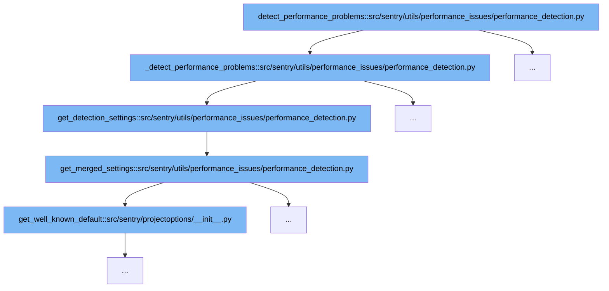

This document outlines the flow of detecting performance issues in Sentry's codebase. It will cover:

1. Initiating performance problem detection
2. Configuring detection settings
3. Merging project-specific settings with defaults



<SwmSnippet path="/src/sentry/utils/performance_issues/performance_detection.py" line="332">

---

# Initiating Performance Problem Detection

The function `detect_performance_problems` serves as the entry point for detecting performance issues. It utilizes `_detect_performance_problems` to process data and identify potential performance problems based on the configured detection settings.

```python
def _detect_performance_problems(
    data: dict[str, Any], sdk_span: Any, project: Project, is_standalone_spans: bool = False
) -> list[PerformanceProblem]:
    event_id = data.get("event_id", None)

    detection_settings = get_detection_settings(project.id)
    detectors: list[PerformanceDetector] = [
        detector_class(detection_settings, data)
        for detector_class in DETECTOR_CLASSES
        if detector_class.is_detector_enabled()
    ]

    for detector in detectors:
        run_detector_on_data(detector, data)

    # Metrics reporting only for detection, not created issues.
    report_metrics_for_detectors(
        data,
        event_id,
        detectors,
        sdk_span,
```

---

</SwmSnippet>

<SwmSnippet path="/src/sentry/utils/performance_issues/performance_detection.py" line="220">

---

# Configuring Detection Settings

The function `get_detection_settings` retrieves and configures the detection settings for performance issues. It calls `get_merged_settings` to combine project-specific settings with default system settings, ensuring that the detection process is tailored to the specific needs of the project.

```python
# Gets the thresholds to perform performance detection.
# Duration thresholds are in milliseconds.
# Allowed span ops are allowed span prefixes. (eg. 'http' would work for a span with 'http.client' as its op)
def get_detection_settings(project_id: int | None = None) -> dict[DetectorType, Any]:
    settings = get_merged_settings(project_id)

    return {
        DetectorType.SLOW_DB_QUERY: [
            {
                "duration_threshold": settings["slow_db_query_duration_threshold"],  # ms
                "allowed_span_ops": ["db"],
                "detection_enabled": settings["slow_db_queries_detection_enabled"],
            },
        ],
        DetectorType.RENDER_BLOCKING_ASSET_SPAN: {
            "fcp_minimum_threshold": settings["render_blocking_fcp_min"],  # ms
            "fcp_maximum_threshold": settings["render_blocking_fcp_max"],  # ms
            "fcp_ratio_threshold": settings["render_blocking_fcp_ratio"],  # in the range [0, 1]
            "minimum_size_bytes": settings["render_blocking_bytes_min"],  # in bytes
            "detection_enabled": settings["large_render_blocking_asset_detection_enabled"],
        },
```

---

</SwmSnippet>

<SwmSnippet path="/src/sentry/utils/performance_issues/performance_detection.py" line="135">

---

# Merging Project-Specific Settings with Defaults

The function `get_merged_settings` merges default system settings with project-specific settings stored in the project options. This ensures that any custom configurations for performance detection are considered during the detection process.

```python
# Merges system defaults, with default project settings and saved project settings.
def get_merged_settings(project_id: int | None = None) -> dict[str | Any, Any]:
    system_settings = {
        "n_plus_one_db_count": options.get("performance.issues.n_plus_one_db.count_threshold"),
        "n_plus_one_db_duration_threshold": options.get(
            "performance.issues.n_plus_one_db.duration_threshold"
        ),
        "slow_db_query_duration_threshold": options.get(
            "performance.issues.slow_db_query.duration_threshold"
        ),
        "render_blocking_fcp_min": options.get(
            "performance.issues.render_blocking_assets.fcp_minimum_threshold"
        ),
        "render_blocking_fcp_max": options.get(
            "performance.issues.render_blocking_assets.fcp_maximum_threshold"
        ),
        "render_blocking_fcp_ratio": options.get(
            "performance.issues.render_blocking_assets.fcp_ratio_threshold"
        ),
        "render_blocking_bytes_min": options.get(
            "performance.issues.render_blocking_assets.size_threshold"
```

---

</SwmSnippet>

&nbsp;

*This is an auto-generated document by Swimm AI 🌊 and has not yet been verified by a human*

<SwmMeta version="3.0.0" repo-id="Z2l0aHViJTNBJTNBc2VudHJ5JTNBJTNBZ2V0c2VudHJ5" repo-name="sentry"><sup>Powered by [Swimm](/)</sup></SwmMeta>
