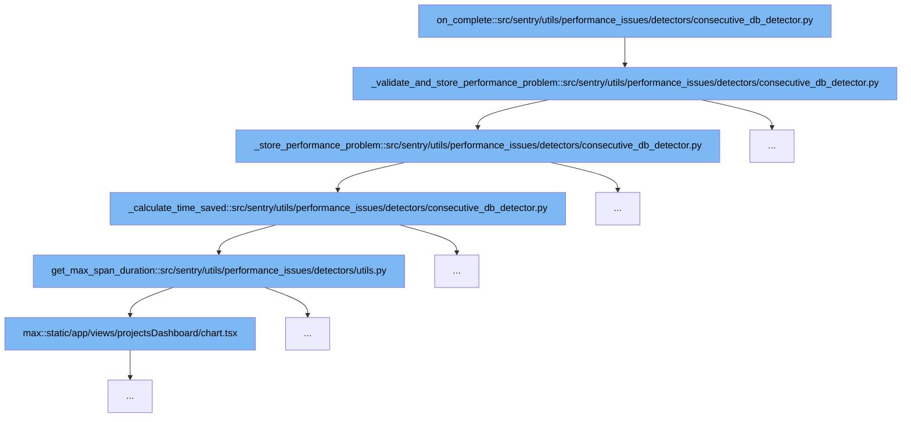

This document will explore the function `on_complete` within the `consecutive_db_detector.py` file, focusing on its role in detecting performance issues related to database operations. We'll cover:

1. The initiation of the performance issue detection process.
2. Validation and storage of detected performance problems.
3. Calculation of time saved by potential optimizations.



<SwmSnippet path="/src/sentry/utils/performance_issues/detectors/consecutive_db_detector.py" line="86">

---

# Initiation of Performance Issue Detection

The `on_complete` function initiates the detection of performance issues by calling `_validate_and_store_performance_problem`. This function sets up the necessary parameters and checks to proceed with further validation and problem storage if conditions are met.

```python
    def _validate_and_store_performance_problem(self):
        self._set_independent_spans(self.consecutive_db_spans)
        if not len(self.independent_db_spans):
            return

        exceeds_count_threshold = len(self.consecutive_db_spans) >= self.settings.get(
            "consecutive_count_threshold"
        )
        exceeds_span_duration_threshold = all(
            get_span_duration(span).total_seconds() * 1000
            > self.settings.get("span_duration_threshold")
            for span in self.independent_db_spans
        )

        time_saved = self._calculate_time_saved(self.independent_db_spans)
        total_time = get_total_span_duration(self.consecutive_db_spans)

        exceeds_time_saved_threshold = time_saved >= self.settings.get("min_time_saved")

        exceeds_time_saved_threshold_ratio = False
        if total_time > 0:
```

---

</SwmSnippet>

<SwmSnippet path="/src/sentry/utils/performance_issues/detectors/consecutive_db_detector.py" line="119">

---

# Validation and Storage of Performance Problems

Upon validation, the `_store_performance_problem` function is called. It handles the creation of a performance problem record, which includes details such as the fingerprint, span IDs, and query descriptions. This step is crucial for tracking and addressing performance issues effectively.

```python
    def _store_performance_problem(self) -> None:
        fingerprint = self._fingerprint()
        offender_span_ids = [span.get("span_id", None) for span in self.independent_db_spans]
        cause_span_ids = [span.get("span_id", None) for span in self.consecutive_db_spans]
        query: str = self.independent_db_spans[0].get("description", None)

        self.stored_problems[fingerprint] = PerformanceProblem(
            fingerprint,
            "db",
            desc=query,  # TODO - figure out which query to use for description
            type=PerformanceConsecutiveDBQueriesGroupType,
            cause_span_ids=cause_span_ids,
            parent_span_ids=None,
            offender_span_ids=offender_span_ids,
            evidence_data={
                "op": "db",
                "cause_span_ids": cause_span_ids,
                "parent_span_ids": None,
                "offender_span_ids": offender_span_ids,
                "transaction_name": self._event.get("transaction", ""),
                "span_evidence_key_value": [
```

---

</SwmSnippet>

<SwmSnippet path="/src/sentry/utils/performance_issues/detectors/consecutive_db_detector.py" line="208">

---

# Calculation of Time Saved

The `_calculate_time_saved` function calculates the potential time saved by optimizing the database queries. This calculation is based on the duration of spans and helps in assessing the impact of the detected performance issues.

```python
    def _calculate_time_saved(self, independent_spans: list[Span]) -> float:
        """
        Calculates the cost saved by running spans in parallel,
        this is the maximum time saved of running all independent queries in parallel
        note, maximum means it does not account for db connection times and overhead associated with parallelization,
        this is where thresholds come in
        """
        consecutive_spans = self.consecutive_db_spans
        total_duration = get_total_span_duration(consecutive_spans)
        max_independent_span_duration = get_max_span_duration(independent_spans)

        sum_of_dependent_span_durations = 0.0
        for span in consecutive_spans:
            if span not in independent_spans:
                sum_of_dependent_span_durations += get_span_duration(span).total_seconds() * 1000

        return total_duration - max(max_independent_span_duration, sum_of_dependent_span_durations)
```

---

</SwmSnippet>

&nbsp;

*This is an auto-generated document by Swimm AI 🌊 and has not yet been verified by a human*

<SwmMeta version="3.0.0" repo-id="Z2l0aHViJTNBJTNBc2VudHJ5JTNBJTNBZ2V0c2VudHJ5" repo-name="sentry"><sup>Powered by [Swimm](/)</sup></SwmMeta>
