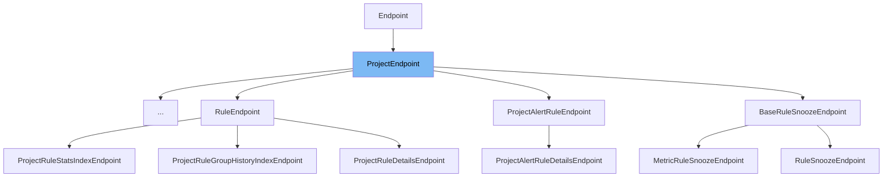

This document will cover the `ProjectEndpoint` class located in `src/sentry/api/bases/project.py`. We'll explore:

1. What `ProjectEndpoint` is and its purpose.
2. The variables and functions defined within `ProjectEndpoint`.
3. How `ProjectEndpoint` is utilized in `ProjectPlatformsEndpoint`.



# What is ProjectEndpoint

The `ProjectEndpoint` class in `src/sentry/api/bases/project.py` serves as a base class for all project-related API endpoints in Sentry. It extends the generic `Endpoint` class and incorporates project-specific permissions and utility methods to handle common tasks such as project retrieval and exception handling related to project operations.

<SwmSnippet path="/src/sentry/api/bases/project.py" line="108">

---

# Variables and functions

`permission_classes` is a tuple that defines the permissions required to access the endpoint. It is set to use `ProjectPermission` by default, ensuring that the endpoint adheres to the defined project access rules.

```python
class ProjectEndpoint(Endpoint):
    permission_classes: tuple[type[BasePermission], ...] = (ProjectPermission,)

```

---

</SwmSnippet>

<SwmSnippet path="/src/sentry/api/bases/project.py" line="111">

---

The `convert_args` method is crucial for extracting and validating the project details from the URL parameters. It ensures the project exists and checks for redirections if the project was moved, handling various edge cases to secure the endpoint.

```python
    def convert_args(
        self,
        request: Request,
        organization_slug: str | int,
        *args,
        **kwargs,
    ):
        if args and args[0] is not None:
            project_id_or_slug: int | str = args[0]
            # Required so it behaves like the original convert_args, where project_id_or_slug was another parameter
            args = args[1:]
        else:
            project_id_or_slug = kwargs.pop("project_id_or_slug", None) or kwargs.pop(
                "project_slug"
            )
        try:
            if id_or_slug_path_params_enabled(
                self.convert_args.__qualname__, str(organization_slug)
            ):
                project = (
                    Project.objects.filter(
```

---

</SwmSnippet>

<SwmSnippet path="/src/sentry/api/bases/project.py" line="198">

---

`get_filter_params` method is used to extract common filtering parameters from the request, such as the time range and environment, which are often used in project-specific queries.

```python
    def get_filter_params(self, request: Request, project, date_filter_optional=False):
        """Similar to the version on the organization just for a single project."""
        # get the top level params -- projects, time range, and environment
        # from the request
        try:
            start, end = get_date_range_from_params(request.GET, optional=date_filter_optional)
        except InvalidParams as e:
            raise ProjectEventsError(str(e))

        environments = [env.name for env in get_environments(request, project.organization)]
        params = {"start": start, "end": end, "project_id": [project.id]}
        if environments:
            params["environment"] = environments

        return params
```

---

</SwmSnippet>

<SwmSnippet path="/src/sentry/api/bases/project.py" line="214">

---

The `handle_exception` method in `ProjectEndpoint` is tailored to handle exceptions specific to project operations, such as `ProjectMoved`, providing a customized response that includes the new project URL and slug.

```python
    def handle_exception(
        self,
        request: Request,
        exc: Exception,
        handler_context: Mapping[str, Any] | None = None,
        scope: Scope | None = None,
    ) -> Response:
        if isinstance(exc, ProjectMoved):
            response = Response(
                {"slug": exc.detail["detail"]["extra"]["slug"], "detail": exc.detail["detail"]},
                status=exc.status_code,
            )
            response["Location"] = exc.detail["detail"]["extra"]["url"]
            return response
        return super().handle_exception(request, exc, handler_context, scope)
```

---

</SwmSnippet>

<SwmSnippet path="/src/sentry/api/endpoints/project_platforms.py" line="13">

---

# Usage example

In `ProjectPlatformsEndpoint`, `ProjectEndpoint` is extended to handle the `GET` request for retrieving platforms associated with a project. It utilizes the `get` method to fetch and serialize the project platform data, showcasing how `ProjectEndpoint` can be extended for specific project-related functionalities.

```python
class ProjectPlatformsEndpoint(ProjectEndpoint):
    publish_status = {
        "GET": ApiPublishStatus.PRIVATE,
    }
    owner = ApiOwner.TELEMETRY_EXPERIENCE

    def get(self, request: Request, project) -> Response:
        queryset = ProjectPlatform.objects.filter(project_id=project.id)
        return Response(serialize(list(queryset), request.user))
```

---

</SwmSnippet>

&nbsp;

*This is an auto-generated document by Swimm AI 🌊 and has not yet been verified by a human*

<SwmMeta version="3.0.0" repo-id="Z2l0aHViJTNBJTNBc2VudHJ5JTNBJTNBZ2V0c2VudHJ5" repo-name="sentry"><sup>Powered by [Swimm](/)</sup></SwmMeta>
