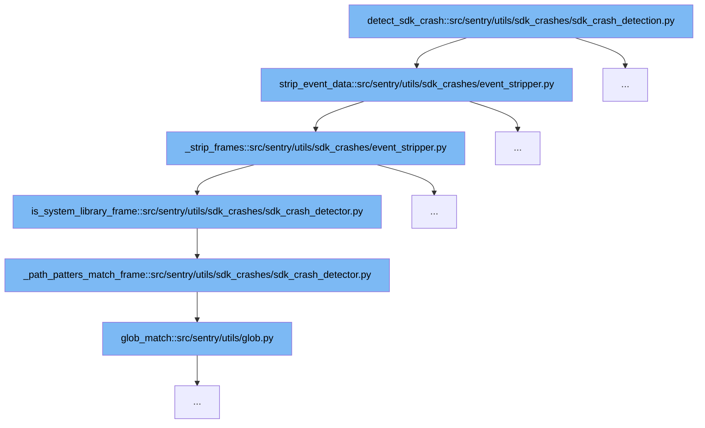

This document will explain the SDK crash detection flow in Sentry, specifically focusing on how the system identifies and processes SDK and system library frames within crash data. The steps involved are:



<SwmSnippet path="/src/sentry/utils/sdk_crashes/sdk_crash_detection.py" line="109">

---

# Detecting SDK Crashes

The function `detect_sdk_crash` initiates the SDK crash detection process. It is responsible for orchestrating the stripping of event data to focus on relevant SDK and system library frames. This is the first step in the flow and sets the stage for more specific frame analysis.

```python

        if sdk_crash_detector.is_sdk_crash(frames):
            # The sample rate is backwards on purpose, because we return None if we don't want to sample an event.
            if random.random() > sample_rate:
                return None

            sdk_crash_event_data = strip_event_data(event.data, sdk_crash_detector)

            set_path(
                sdk_crash_event_data,
                "contexts",
                "sdk_crash_detection",
                value={
                    "original_project_id": event.project.id,
                    "original_event_id": event.event_id,
                },
            )

            sdk_version = get_path(sdk_crash_event_data, "sdk", "version")
            set_path(sdk_crash_event_data, "release", value=sdk_version)

```

---

</SwmSnippet>

<SwmSnippet path="/src/sentry/utils/sdk_crashes/event_stripper.py" line="109">

---

# Stripping Event Data

In this step, `strip_event_data` processes the crash data to remove unnecessary information, focusing only on frames that are either from the SDK or system libraries. This method ensures that the data being analyzed is relevant to the crash detection goals.

```python
def strip_event_data(
    event_data: NodeData, sdk_crash_detector: SDKCrashDetector
) -> Mapping[str, Any]:
    """
    This method keeps only properties based on the ALLOW_LIST. For frames, both the allow list applies,
    and the method only keeps SDK frames and system library frames.
    """

    frames = get_path(event_data, "exception", "values", -1, "stacktrace", "frames")
    if not frames:
        return {}

    # We strip the frames first because applying the allowlist removes fields that are needed
    # for deciding wether to keep a frame or not.
    stripped_frames = _strip_frames(frames, sdk_crash_detector)

    event_data_copy = dict(event_data)
    event_data_copy["exception"]["values"][0]["stacktrace"]["frames"] = stripped_frames

    stripped_event_data = _strip_event_data_with_allowlist(event_data_copy, EVENT_DATA_ALLOWLIST)

```

---

</SwmSnippet>

<SwmSnippet path="/src/sentry/utils/sdk_crashes/sdk_crash_detector.py" line="105">

---

# Identifying System Library Frames

The `is_system_library_frame` function checks if a frame belongs to a system library based on predefined path patterns. This is crucial for distinguishing between SDK frames and system library frames, which helps in accurate crash reporting and analysis.

```python
        return self._path_patters_match_frame(self.config.sdk_frame_config.path_patterns, frame)

    def is_system_library_frame(self, frame: Mapping[str, Any]) -> bool:
        return self._path_patters_match_frame(self.config.system_library_path_patterns, frame)
```

---

</SwmSnippet>

<SwmSnippet path="/src/sentry/utils/sdk_crashes/sdk_crash_detector.py" line="110">

---

# Matching Path Patterns

The `_path_patters_match_frame` function is used to match frame paths against a set of patterns to determine if they should be considered as part of the system library frames. This function supports the identification process by providing pattern matching capabilities.

```python
    def _path_patters_match_frame(self, path_patters: set[str], frame: Mapping[str, Any]) -> bool:
        for field in self.fields_containing_paths:
            for pattern in path_patters:
                field_with_path = frame.get(field)
                if field_with_path and glob_match(
                    field_with_path, pattern, ignorecase=True, doublestar=True, path_normalize=True
                ):
                    return True

        return False
```

---

</SwmSnippet>

<SwmSnippet path="/src/sentry/utils/glob.py" line="1">

---

# Glob Pattern Matching

The `glob_match` function from the `glob.py` module is utilized to perform the actual pattern matching. This function is critical as it provides the low-level matching logic used by `_path_patters_match_frame` to validate frame paths against the specified patterns.

```python
from sentry_relay.processing import is_glob_match


def glob_match(
    value, pat, doublestar=False, ignorecase=False, path_normalize=False, allow_newline=True
):
    """A beefed up version of fnmatch.fnmatch"""
    return is_glob_match(
        value if value is not None else "",
        pat,
        double_star=doublestar,
        case_insensitive=ignorecase,
        path_normalize=path_normalize,
        allow_newline=allow_newline,
    )

```

---

</SwmSnippet>

&nbsp;

*This is an auto-generated document by Swimm AI 🌊 and has not yet been verified by a human*

<SwmMeta version="3.0.0" repo-id="Z2l0aHViJTNBJTNBc2VudHJ5JTNBJTNBZ2V0c2VudHJ5" repo-name="sentry"><sup>Powered by [Swimm](/)</sup></SwmMeta>
