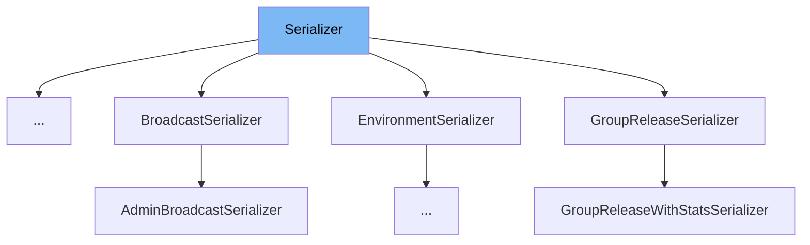

This document will cover the Serializer class located in `src/sentry/api/serializers/base.py`. We'll explore:

1. What is Serializer
2. Variables and functions
3. Usage example



# What is Serializer

The `Serializer` class in `src/sentry/api/serializers/base.py` is designed to handle the serialization of objects into a format suitable for HTTP responses. It primarily converts complex data types like Django models into Python primitives that are easily JSON serializable. This class is crucial for preparing data for API responses, ensuring that data sent to clients is in a readable and secure format.

<SwmSnippet path="/src/sentry/api/serializers/base.py" line="16">

---

# Variables and functions

The `registry` variable is a mutable mapping used to store serializers based on their type. This allows for dynamic retrieval and registration of serializers.

```python
registry: MutableMapping[Any, Any] = {}
```

---

</SwmSnippet>

<SwmSnippet path="/src/sentry/api/serializers/base.py" line="19">

---

The `register` function is a decorator used to add a serializer class to the `registry` for a specific type. This function enhances modularity by allowing different parts of the application to use the serializer independently.

```python
def register(type: Any) -> Callable[[type[K]], type[K]]:
    """A wrapper that adds the wrapped Serializer to the Serializer registry (see above) for the key `type`."""

    def wrapped(cls: type[K]) -> type[K]:
        registry[type] = cls()
        return cls

    return wrapped
```

---

</SwmSnippet>

<SwmSnippet path="/src/sentry/api/serializers/base.py" line="29">

---

The `serialize` function is the core of the Serializer class, handling the conversion of objects (or lists of objects) into a serialized format. It uses the serializer from the registry or the provided serializer to process the data.

```python
def serialize(
    objects: Any | Sequence[Any],
    user: Any | None = None,
    serializer: Any | None = None,
    **kwargs: Any,
) -> Any:
    """
    Turn a model (or list of models) into a python object made entirely of primitives.

    :param objects: A list of objects
    :param user: The user who will be viewing the objects. Omit to view as `AnonymousUser`.
    :param serializer: The `Serializer` class whose logic we'll use to serialize
        `objects` (see below.) Omit to just look up the Serializer in the
        registry by the `objects`'s type.
    :param kwargs Any
    :returns A list of the serialized versions of `objects`.
    """
    if user is None:
        user = AnonymousUser()

    if not objects:
```

---

</SwmSnippet>

&nbsp;

*This is an auto-generated document by Swimm AI 🌊 and has not yet been verified by a human*

<SwmMeta version="3.0.0" repo-id="Z2l0aHViJTNBJTNBc2VudHJ5JTNBJTNBZ2V0c2VudHJ5" repo-name="sentry"><sup>Powered by [Swimm](/)</sup></SwmMeta>
