This document will cover the flow of sending activity notifications to Slack threads in Sentry. We'll explore:

1. How the notification process starts with an activity.
2. The steps involved in notifying all threads for an activity.
3. Handling individual parent notifications.
4. Posting the notification to Slack.

```mermaid
graph TD;
  send_activity_notifications_to_slack_threads::src/sentry/integrations/slack/tasks/send_notifications_on_activity.py:::mainFlowStyle --> notify_all_threads_for_activity::src/sentry/integrations/slack/service.py
  send_activity_notifications_to_slack_threads::src/sentry/integrations/slack/tasks/send_notifications_on_activity.py:::mainFlowStyle --> 1bsi0[...]
  notify_all_threads_for_activity::src/sentry/integrations/slack/service.py:::mainFlowStyle --> _handle_parent_notification::src/sentry/integrations/slack/service.py
  notify_all_threads_for_activity::src/sentry/integrations/slack/service.py:::mainFlowStyle --> 7kqut[...]
  _handle_parent_notification::src/sentry/integrations/slack/service.py:::mainFlowStyle --> post::src/sentry/integrations/slack/webhooks/action.py
  _handle_parent_notification::src/sentry/integrations/slack/service.py:::mainFlowStyle --> meckw[...]
  post::src/sentry/integrations/slack/webhooks/action.py:::mainFlowStyle --> handle_member_approval::src/sentry/integrations/slack/webhooks/action.py
  post::src/sentry/integrations/slack/webhooks/action.py:::mainFlowStyle --> _handle_group_actions::src/sentry/integrations/slack/webhooks/action.py
  post::src/sentry/integrations/slack/webhooks/action.py:::mainFlowStyle --> bind_org_context_from_integration::src/sentry/integrations/utils/scope.py
  post::src/sentry/integrations/slack/webhooks/action.py:::mainFlowStyle --> ah517[...]
  handle_member_approval::src/sentry/integrations/slack/webhooks/action.py --> approve_member_invitation::src/sentry/models/organizationmember.py
  handle_member_approval::src/sentry/integrations/slack/webhooks/action.py --> reject_member_invitation::src/sentry/models/organizationmember.py
  handle_member_approval::src/sentry/integrations/slack/webhooks/action.py --> 9nmcf[...]
  approve_member_invitation::src/sentry/models/organizationmember.py --> send_invite_email::src/sentry/models/organizationmember.py
  approve_member_invitation::src/sentry/models/organizationmember.py --> create_audit_entry_from_user::src/sentry/utils/audit.py
  approve_member_invitation::src/sentry/models/organizationmember.py --> ujpuk[...]
  reject_member_invitation::src/sentry/models/organizationmember.py --> delete::src/sentry/models/project.py
  reject_member_invitation::src/sentry/models/organizationmember.py --> create_audit_entry_from_user::src/sentry/utils/audit.py
  reject_member_invitation::src/sentry/models/organizationmember.py --> azzqa[...]
  bind_org_context_from_integration::src/sentry/integrations/utils/scope.py:::mainFlowStyle --> get_organization_by_id::src/sentry/services/hybrid_cloud/organization/impl.py
  bind_org_context_from_integration::src/sentry/integrations/utils/scope.py:::mainFlowStyle --> mhx8x[...]
  get_organization_by_id::src/sentry/services/hybrid_cloud/organization/impl.py:::mainFlowStyle --> check_membership_by_id::src/sentry/services/hybrid_cloud/organization/impl.py
  get_organization_by_id::src/sentry/services/hybrid_cloud/organization/impl.py:::mainFlowStyle --> 15le5[...]
  check_membership_by_id::src/sentry/services/hybrid_cloud/organization/impl.py:::mainFlowStyle --> serialize_member::src/sentry/services/hybrid_cloud/organization/serial.py
  serialize_member::src/sentry/services/hybrid_cloud/organization/serial.py:::mainFlowStyle --> get_email::src/sentry/models/organizationmember.py
  serialize_member::src/sentry/services/hybrid_cloud/organization/serial.py:::mainFlowStyle --> bqj3h[...]
  get_email::src/sentry/models/organizationmember.py:::mainFlowStyle --> get_user::src/sentry/middleware/auth.py
  get_email::src/sentry/models/organizationmember.py:::mainFlowStyle --> rwqko[...]
  get_user::src/sentry/middleware/auth.py:::mainFlowStyle --> ...

 classDef mainFlowStyle color:#000000,fill:#7CB9F4
```



<SwmSnippet path="/src/sentry/integrations/slack/tasks/send_notifications_on_activity.py" line="1">

---

# Starting the Notification Process

The function `send_activity_notifications_to_slack_threads` initiates the process of sending notifications to Slack threads based on an activity. It serves as the entry point for the notification flow.

```python
import logging
```

---

</SwmSnippet>

<SwmSnippet path="/src/sentry/integrations/slack/service.py" line="86">

---

# Notifying All Threads for an Activity

The function `notify_all_threads_for_activity` is called next. It checks if the activity is associated with a group and a user, and if valid, it prepares the notification message to be sent to all parent notifications related to the activity's group and project.

```python
    def notify_all_threads_for_activity(self, activity: Activity) -> None:
        """
        For an activity related to an issue group, send notifications in a Slack thread to all parent notifications for
        that specific group and project.

        If the group is not associated with an activity, return early as there's nothing to do.
        If the user is not associated with an activity, return early as we only care about user activities.
        """
        if activity.group is None:
            self._logger.info(
                "no group associated on the activity, nothing to do",
                extra={
                    "activity_id": activity.id,
                },
            )
            return None

        if activity.user_id is None:
            self._logger.info(
                "machine/system updates are ignored at this time, nothing to do",
                extra={
```

---

</SwmSnippet>

<SwmSnippet path="/src/sentry/integrations/slack/service.py" line="166">

---

# Handling Individual Parent Notifications

Within `notify_all_threads_for_activity`, the function `_handle_parent_notification` is called for each parent notification. It prepares the payload and sends the notification message to the appropriate Slack channel and thread.

```python
    def _handle_parent_notification(
        self,
        parent_notification: IssueAlertNotificationMessage,
        notification_to_send: str,
        client: SlackClient,
    ) -> None:
        # For each parent notification, we need to get the channel that the notification is replied to
        # Get the channel by using the action uuid
        if not parent_notification.rule_fire_history:
            raise RuleDataError(
                f"parent notification {parent_notification.id} does not have a rule_fire_history"
            )

        if not parent_notification.rule_action_uuid:
            raise RuleDataError(
                f"parent notification {parent_notification.id} does not have a rule_action_uuid"
            )

        rule: Rule = parent_notification.rule_fire_history.rule
        rule_action = rule.get_rule_action_details_by_uuid(parent_notification.rule_action_uuid)
        if not rule_action:
```

---

</SwmSnippet>

<SwmSnippet path="/src/sentry/integrations/slack/webhooks/action.py" line="781">

---

# Posting the Notification to Slack

Finally, the `post` method in `src/sentry/integrations/slack/webhooks/action.py` is used to send the prepared notification to Slack. This method handles the actual API call to Slack's `chat.postMessage` endpoint.

```python
    def post(self, request: Request) -> Response:
        try:
            slack_request = self.slack_request_class(request)
            slack_request.validate()
        except SlackRequestError as e:
            logger.info(
                "slack.action.request-error", extra={"error": str(e), "status_code": e.status}
            )
            return self.respond(status=e.status)

        logger.info(
            "slack.action.request",
            extra={
                "trigger_id": slack_request.data.get("trigger_id"),
                "integration_id": slack_request.integration.id,
                "request_data": slack_request.data,
            },
        )

        # Set organization scope

```

---

</SwmSnippet>

&nbsp;

*This is an auto-generated document by Swimm AI 🌊 and has not yet been verified by a human*

<SwmMeta version="3.0.0" repo-id="Z2l0aHViJTNBJTNBc2VudHJ5JTNBJTNBZ2V0c2VudHJ5" repo-name="sentry"><sup>Powered by [Swimm](/)</sup></SwmMeta>
