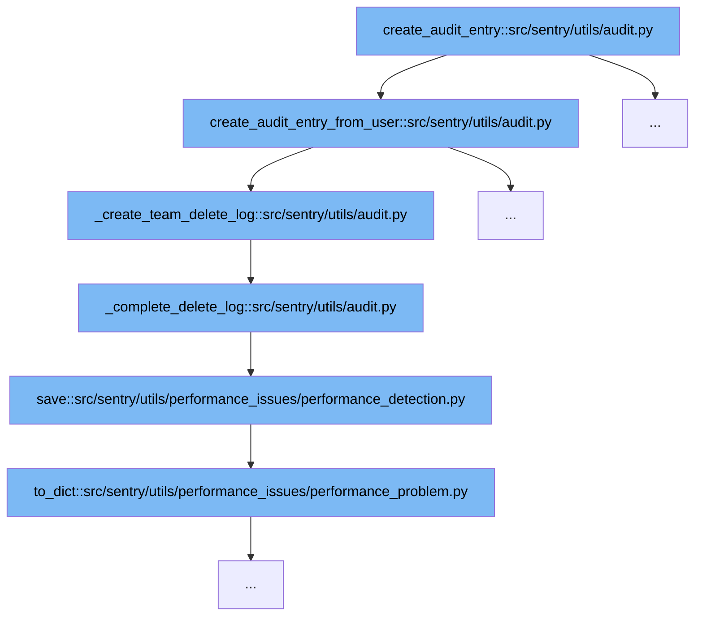

This document will explore the audit entry creation process in Sentry, specifically focusing on the deletion of a team. The steps involved are:



<SwmSnippet path="/src/sentry/utils/audit.py" line="67">

---

# Initial Audit Entry Creation

The function `create_audit_entry_from_user` initializes the audit process by creating an `AuditLogEntry`. This entry includes details such as the actor, IP address, and organization involved. It's the first step in logging significant actions within the system, such as deletions.

```python
def create_audit_entry_from_user(
    user: User | RpcUser | None,
    api_key: ApiKey | None = None,
    ip_address: str | None = None,
    transaction_id: int | str | None = None,
    logger: Logger | None = None,
    organization: Organization | RpcOrganization | None = None,
    organization_id: int | None = None,
    **kwargs: Any,
) -> AuditLogEntry:
    organization_id = _org_id(organization, organization_id)

    entry = AuditLogEntry(
        actor_id=user.id if user else None,
        actor_key=api_key,
        ip_address=ip_address,
        organization_id=organization_id,
        **kwargs,
    )

    # Only create a real AuditLogEntry record if we are passing an event type
```

---

</SwmSnippet>

<SwmSnippet path="/src/sentry/utils/audit.py" line="174">

---

# Team Deletion Log Creation

Following the initial audit entry, the `_create_team_delete_log` function is called if the event is related to a team removal. This function fetches the team details and prepares a deletion log, which includes the team's name, slug, and the date it was created. This step is crucial for maintaining a record of team deletions.

```python
def _create_team_delete_log(entry: AuditLogEntry, audit_log_actor: RpcAuditLogEntryActor) -> None:
    delete_log = DeletedTeam()

    team = Team.objects.get(id=entry.target_object)
    delete_log.name = team.name
    delete_log.slug = team.slug
    delete_log.date_created = team.date_added

    organization = Organization.objects.get(id=entry.organization_id)
    delete_log.organization_id = organization.id
    delete_log.organization_name = organization.name
    delete_log.organization_slug = organization.slug

    _complete_delete_log(delete_log=delete_log, audit_log_actor=audit_log_actor)
```

---

</SwmSnippet>

<SwmSnippet path="/src/sentry/utils/audit.py" line="191">

---

# Completing the Deletion Log

The deletion log is finalized in the `_complete_delete_log` function. It adds the actor's details to the log and saves it. This step ensures that all necessary information about the deletion and the responsible actor is recorded for audit purposes.

```python
def _complete_delete_log(delete_log: DeletedEntry, audit_log_actor: RpcAuditLogEntryActor) -> None:
    """
    Adds common information on a delete log from an audit entry and
    saves that delete log.
    """
    delete_log.actor_label = audit_log_actor.actor_label
    delete_log.actor_id = audit_log_actor.actor_id
    delete_log.actor_key = audit_log_actor.actor_key
    delete_log.ip_address = audit_log_actor.ip_address

    delete_log.save()
```

---

</SwmSnippet>

<SwmSnippet path="/src/sentry/utils/performance_issues/performance_detection.py" line="93">

---

# Saving the Deletion Log

Finally, the `save` function in the performance detection module is used to store the deletion log. This function uses the `nodestore.backend` to persist the log, ensuring it is available for future audits and performance analysis.

```python
    def save(self):
        nodestore.backend.set(self.identifier, self.problem.to_dict())
```

---

</SwmSnippet>

&nbsp;

*This is an auto-generated document by Swimm AI 🌊 and has not yet been verified by a human*

<SwmMeta version="3.0.0" repo-id="Z2l0aHViJTNBJTNBc2VudHJ5JTNBJTNBZ2V0c2VudHJ5" repo-name="sentry"><sup>Powered by [Swimm](/)</sup></SwmMeta>
