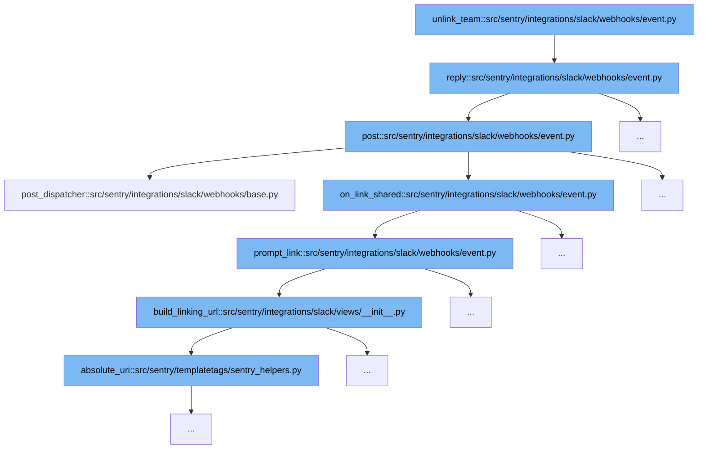

This document outlines the flow of unlinking a team in Sentry's Slack integration, detailing each function's role in the process:



<SwmSnippet path="/src/sentry/integrations/slack/webhooks/event.py" line="48">

---

# Starting the Unlink Team Process

The `unlink_team` function initiates the process to unlink a team from Slack. It serves as the entry point for the unlinking flow.

```python
        client = SlackClient(integration_id=slack_request.integration.id)
```

---

</SwmSnippet>

<SwmSnippet path="/src/sentry/integrations/slack/webhooks/event.py" line="46">

---

# Sending a Reply

The `reply` function is called next, which constructs a response message to be sent back to Slack. This function handles the creation of the payload and the interaction with the Slack API.

```python
    def reply(self, slack_request: SlackDMRequest, message: str) -> Response:
        payload = {"channel": slack_request.channel_id, "text": message}
        client = SlackClient(integration_id=slack_request.integration.id)
        try:
            client.post("/chat.postMessage", data=payload, json=True)
        except ApiError as e:
            logger.error("slack.event.on-message-error", extra={"error": str(e)})

        return self.respond()
```

---

</SwmSnippet>

<SwmSnippet path="/src/sentry/integrations/slack/webhooks/event.py" line="210">

---

# Posting the Message

Following the reply, the `post` function is used to actually send the message to Slack. It handles different types of Slack requests and dispatches them accordingly.

```python
    # TODO(dcramer): implement app_uninstalled and tokens_revoked
    def post(self, request: Request) -> Response:
        try:
            slack_request = self.slack_request_class(request)
            slack_request.validate()
        except SlackRequestError as e:
            return self.respond(status=e.status)

        if slack_request.is_challenge():
            return self.on_url_verification(request, slack_request.data)
        if slack_request.type == "link_shared":
            if self.on_link_shared(request, slack_request):
                return self.respond()

        if slack_request.type == "message":
            if slack_request.is_bot():
                return self.respond()

            command, _ = slack_request.get_command_and_args()

            if command in COMMANDS:
```

---

</SwmSnippet>

<SwmSnippet path="/src/sentry/integrations/slack/webhooks/base.py" line="26">

---

# Dispatching the Post

The `post_dispatcher` function is called within the `post` function to further handle specific commands related to linking and unlinking teams.

```python
    def post_dispatcher(self, request: SlackDMRequest) -> Response:
        """
        All Slack commands are handled by this endpoint. This block just
        validates the request and dispatches it to the right handler.
        """
        command, args = request.get_command_and_args()

        if command in ["help", ""]:
            return self.respond(SlackHelpMessageBuilder().build())

        if command == "link":
            if not args:
                return self.link_user(request)

            if args[0] == "team":
                return self.link_team(request)

        if command == "unlink":
            if not args:
                return self.unlink_user(request)

```

---

</SwmSnippet>

<SwmSnippet path="/src/sentry/integrations/slack/webhooks/event.py" line="220">

---

# Handling Link Shared

The `on_link_shared` function is triggered if the Slack request type is 'link_shared'. It calls the `prompt_link` function to handle the request.

```python
        if slack_request.type == "link_shared":
            if self.on_link_shared(request, slack_request):
                return self.respond()
```

---

</SwmSnippet>

<SwmSnippet path="/src/sentry/integrations/slack/webhooks/event.py" line="65">

---

# Prompting to Link

The `prompt_link` function generates a URL for linking a user's Slack identity to Sentry, using the `build_linking_url` function.

```python
    def prompt_link(self, slack_request: SlackDMRequest) -> None:
        associate_url = build_linking_url(
            integration=slack_request.integration,
            slack_id=slack_request.user_id,
            channel_id=slack_request.channel_id,
            response_url=slack_request.response_url,
        )
        if not slack_request.channel_id:
            return

        payload = {
            "channel": slack_request.channel_id,
            "user": slack_request.user_id,
            "text": "Link your Slack identity to Sentry to unfurl Discover charts.",
            **SlackPromptLinkMessageBuilder(associate_url).as_payload(),
        }

        client = SlackClient(integration_id=slack_request.integration.id)
        try:
            client.post("/chat.postEphemeral", data=payload)
        except ApiError as e:
```

---

</SwmSnippet>

<SwmSnippet path="/src/sentry/integrations/slack/views/__init__.py" line="20">

---

# Building the Linking URL

Finally, the `build_linking_url` function constructs the actual URL used for linking, which is then used in the `prompt_link` function.

```python
def build_linking_url(endpoint: str, **kwargs: Any) -> str:
    """TODO(mgaeta): Remove cast once sentry/utils/http.py is typed."""
    url: str = absolute_uri(reverse(endpoint, kwargs={"signed_params": sign(**kwargs)}))
    return url
```

---

</SwmSnippet>

&nbsp;

*This is an auto-generated document by Swimm AI 🌊 and has not yet been verified by a human*

<SwmMeta version="3.0.0" repo-id="Z2l0aHViJTNBJTNBc2VudHJ5JTNBJTNBZ2V0c2VudHJ5" repo-name="sentry"><sup>Powered by [Swimm](/)</sup></SwmMeta>
