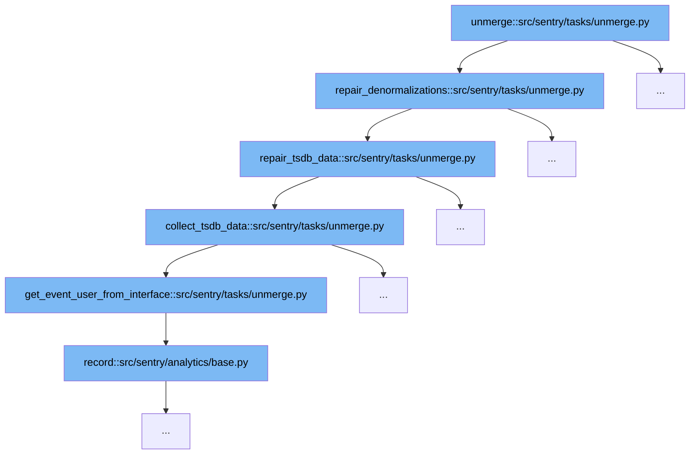

This document will explore the function and flow of the `unmerge` task in Sentry's codebase, specifically focusing on how it handles event data to maintain data integrity after an unmerge operation. The steps involved are:



# Overview of Unmerge Task

The `unmerge` task in Sentry is designed to handle the separation of aggregated error events into distinct groups. This process is crucial when an issue that was previously thought to be a single bug is later identified as multiple distinct issues.

<SwmSnippet path="/src/sentry/tasks/unmerge.py" line="462">

---

# Step 1: Repair Denormalizations

The `repair_denormalizations` function is the first step in the unmerge task. It ensures that group-related data such as environment and release information is correctly associated with the new, separate event groups. This function calls `repair_tsdb_data` to handle time series data adjustments.

```python
def repair_denormalizations(caches, project, events):
    repair_group_environment_data(caches, project, events)
    repair_group_release_data(caches, project, events)
    repair_tsdb_data(caches, project, events)

    for event in events:
```

---

</SwmSnippet>

<SwmSnippet path="/src/sentry/tasks/unmerge.py" line="444">

---

# Step 2: Repair TSDB Data

Following the repair of denormalizations, `repair_tsdb_data` adjusts the time series database entries to reflect the new grouping of events. It processes counters, sets, and frequencies of events, ensuring that metrics like event counts and user impacts are updated to reflect the unmerged groups.

```python
def repair_tsdb_data(caches, project, events):
    counters, sets, frequencies = collect_tsdb_data(caches, project, events)

    for timestamp, data in counters.items():
        for model, keys in data.items():
            for (key, environment_id), value in keys.items():
                tsdb.backend.incr(model, key, timestamp, value, environment_id=environment_id)

    for timestamp, data in sets.items():
        for model, keys in data.items():
            for (key, environment_id), values in keys.items():
                # TODO: This should use `record_multi` rather than `record`.
                tsdb.backend.record(model, key, values, timestamp, environment_id=environment_id)

    for timestamp, data in frequencies.items():
        tsdb.backend.record_frequency_multi(data.items(), timestamp)
```

---

</SwmSnippet>

<SwmSnippet path="/src/sentry/tasks/unmerge.py" line="399">

---

# Step 3: Collect TSDB Data

The `collect_tsdb_data` function gathers the necessary time series data that needs adjustment. This function is crucial for aggregating the data that will be modified in the previous step to ensure the integrity and accuracy of event metrics post-unmerge.

```python
def collect_tsdb_data(caches, project, events):
    counters: dict[datetime, dict[TSDBModel, dict[tuple[int, int], int]]] = defaultdict(
        lambda: defaultdict(lambda: defaultdict(int))
    )

    sets: dict[datetime, dict[TSDBModel, dict[tuple[int, int], set[str]]]] = defaultdict(
        lambda: defaultdict(lambda: defaultdict(set))
    )

    frequencies: dict[datetime, dict[TSDBModel, dict[int, dict[int, int]]]] = defaultdict(
        lambda: defaultdict(lambda: defaultdict(lambda: defaultdict(int)))
    )

    for event in events:
        environment = caches["Environment"](project.organization_id, get_environment_name(event))

        counters[event.datetime][TSDBModel.group][(event.group_id, environment.id)] += 1

        user = event.data.get("user")
        if user:
            sets[event.datetime][TSDBModel.users_affected_by_group][
```

---

</SwmSnippet>

<SwmSnippet path="/src/sentry/tasks/unmerge.py" line="383">

---

# Step 4: Get Event User from Interface

This function extracts user information from event data, which is essential for re-associating events with the correct user identities after an unmerge. This step ensures that user-centric data remains consistent and accurate.

```python
def get_event_user_from_interface(value, project):
    analytics.record(
        "eventuser_endpoint.request",
        project_id=project.id,
        endpoint="sentry.tasks.unmerge.get_event_user_from_interface",
    )
    return EventUser(
        user_ident=value.get("id"),
        email=value.get("email"),
        username=value.get("valuename"),
        ip_address=value.get("ip_address"),
        project_id=project.id,
        name=None,
    )
```

---

</SwmSnippet>

<SwmSnippet path="/src/sentry/analytics/base.py" line="1">

---

# Step 5: Record Analytics

Finally, the `record` function in the analytics module logs the unmerge operation, providing insights into the usage and triggers of the unmerge task. This step is crucial for monitoring and auditing the unmerge operations.

```python
from __future__ import annotations

__all__ = ("Analytics",)

import abc
from typing import Any

from sentry.analytics.event import Event
from sentry.utils.services import Service

from .event_manager import default_manager


class Analytics(Service, abc.ABC):
    __all__ = ("record", "validate")

    event_manager = default_manager

    def record(
        self, event_or_event_type: str | Event | Any, instance: Any | None = None, **kwargs: Any
    ) -> None:
```

---

</SwmSnippet>

&nbsp;

*This is an auto-generated document by Swimm AI 🌊 and has not yet been verified by a human*

<SwmMeta version="3.0.0" repo-id="Z2l0aHViJTNBJTNBc2VudHJ5JTNBJTNBZ2V0c2VudHJ5" repo-name="sentry"><sup>Powered by [Swimm](/)</sup></SwmMeta>
