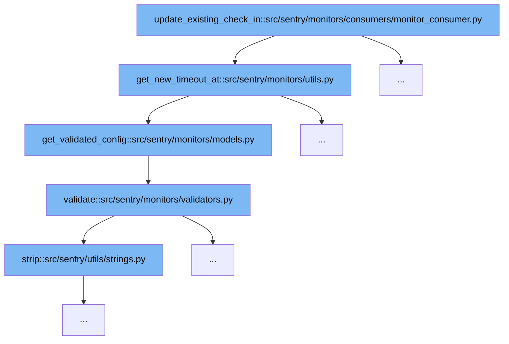

This document will explore the function `update_existing_check_in` and its associated code flow within the Sentry application. The flow involves several function calls across different modules, which collectively contribute to updating an existing check-in with a new timeout. Here's what we'll cover:

1. The purpose of the `update_existing_check_in` function.
2. How the function interacts with other components to achieve its goal.



<SwmSnippet path="/src/sentry/monitors/consumers/monitor_consumer.py" line="1">

---

# Purpose of `update_existing_check_in`

The `update_existing_check_in` function is designed to update the timeout for an existing check-in based on new conditions. It serves as the entry point for the timeout update process in the monitoring system.

```python
from __future__ import annotations
```

---

</SwmSnippet>

<SwmSnippet path="/src/sentry/monitors/consumers/monitor_consumer.py" line="1">

---

# Interaction with `get_new_timeout_at`

The `update_existing_check_in` function calls `get_new_timeout_at` from `src/sentry/monitors/utils.py` to calculate the new timeout based on the updated status and time.

```python
from __future__ import annotations
```

---

</SwmSnippet>

<SwmSnippet path="/src/sentry/monitors/utils.py" line="73">

---

# Role of `get_validated_config`

Within `get_new_timeout_at`, the `get_validated_config` function from `src/sentry/monitors/models.py` is invoked to fetch and validate the monitor's configuration, ensuring it meets the required schema.

```python
# Generates a timeout_at value for existing check-ins that are being updated
def get_new_timeout_at(
    checkin: MonitorCheckIn, new_status: CheckInStatus, date_updated: datetime
) -> datetime | None:
    return get_timeout_at(checkin.monitor.get_validated_config(), new_status, date_updated)
```

---

</SwmSnippet>

<SwmSnippet path="/src/sentry/monitors/models.py" line="369">

---

# Validation Process in `validate`

The configuration obtained is then passed to the `validate` function in `src/sentry/monitors/validators.py`, which checks for the correctness of schedule types and other parameters, crucial for determining the appropriate timeout.

```python
    def get_validated_config(self):
        try:
            jsonschema.validate(self.config, MONITOR_CONFIG)
            return self.config
        except jsonschema.ValidationError:
            logging.exception("Monitor: %s invalid config: %s", self.id, self.config)
```

---

</SwmSnippet>

<SwmSnippet path="/src/sentry/monitors/validators.py" line="166">

---

# Final Step: Using `strip`

The `validate` function utilizes the `strip` method from `src/sentry/utils/strings.py` to clean up the schedule string, removing any unnecessary spaces or non-standard characters, which is vital for the accurate scheduling of the check-in.

```python
    def validate(self, attrs):
        if "schedule_type" in attrs:
            schedule_type = attrs["schedule_type"]
        elif self.instance:
            schedule_type = self.instance.get("schedule_type")
        else:
            schedule_type = None

        # Remove blank timezone values
        if attrs.get("timezone") == "":
            del attrs["timezone"]

        schedule = attrs.get("schedule")
        if not schedule:
            return attrs

        # Translate alternative schedule type key
        if isinstance(schedule, dict) and schedule.get("type"):
            schedule_type = schedule.get("type")
            schedule_type = SCHEDULE_TYPES.get(schedule_type)

```

---

</SwmSnippet>

&nbsp;

*This is an auto-generated document by Swimm AI 🌊 and has not yet been verified by a human*

<SwmMeta version="3.0.0" repo-id="Z2l0aHViJTNBJTNBc2VudHJ5JTNBJTNBZ2V0c2VudHJ5" repo-name="sentry"><sup>Powered by [Swimm](/)</sup></SwmMeta>
