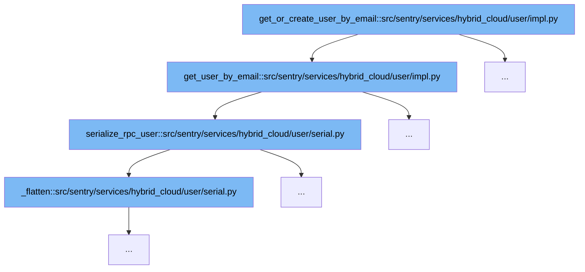

This document will explain the function `get_or_create_user_by_email` and its role in the user management flow within Sentry's hybrid cloud service. We'll cover:

1. The initial user retrieval or creation process.
2. How user details are serialized for RPC communication.



<SwmSnippet path="/src/sentry/services/hybrid_cloud/user/impl.py" line="226">

---

# Initial User Retrieval or Creation

The function `get_or_create_user_by_email` begins by attempting to retrieve a user by their email using the `get_user_by_email` function. If the user exists and matches the provided identity, they are returned; otherwise, a new user creation process would be triggered (not shown in the provided code). This step is crucial for ensuring that the user data is up-to-date and that duplicate user entries are minimized.

```python
    def get_user_by_email(
        self,
        *,
        email: str,
        ident: str | None = None,
    ) -> RpcUser | None:
        user_query = User.objects.filter(email__iexact=email, is_active=True)
        if user_query.exists():
            # Users are not supposed to have the same email but right now our auth pipeline let this happen
            # So let's not break the user experience. Instead return the user with auth identity of ident or
            # the first user if ident is None
            user = user_query[0]
            if user_query.count() > 1:
                logger.warning("Email has multiple users", extra={"email": email})
                if ident:
                    identity_query = AuthIdentity.objects.filter(user__in=user_query, ident=ident)
                    if identity_query.exists():
                        user = identity_query[0].user
                    if identity_query.count() > 1:
                        logger.warning(
                            "Email has two auth identity for the same ident",
```

---

</SwmSnippet>

<SwmSnippet path="/src/sentry/services/hybrid_cloud/user/serial.py" line="62">

---

# Serializing User Details for RPC

After retrieving or creating the user, the `serialize_rpc_user` function is called to transform the user object into a format suitable for RPC communication. This includes flattening user roles and permissions, and handling user-related attributes like emails and avatars, ensuring that all necessary user information is packaged correctly for remote procedure calls.

```python
def serialize_rpc_user(user: User) -> RpcUser:
    args = _serialize_from_user_fields(user)

    # Prefer eagerloaded attributes from _base_query
    if hasattr(user, "useremails") and user.useremails is not None:
        args["emails"] = frozenset([e["email"] for e in user.useremails if e["is_verified"]])
    else:
        args["emails"] = frozenset([email.email for email in user.get_verified_emails()])

    # And process the _base_query special data additions
    args["permissions"] = frozenset(getattr(user, "permissions", None) or ())

    roles: frozenset[str] = frozenset()
    if hasattr(user, "roles") and user.roles is not None:
        roles = frozenset(_flatten(user.roles))
    args["roles"] = roles

    args["useremails"] = [
        RpcUserEmail(id=e["id"], email=e["email"], is_verified=e["is_verified"])
        for e in (getattr(user, "useremails", None) or ())
    ]
```

---

</SwmSnippet>

&nbsp;

*This is an auto-generated document by Swimm AI 🌊 and has not yet been verified by a human*

<SwmMeta version="3.0.0" repo-id="Z2l0aHViJTNBJTNBc2VudHJ5JTNBJTNBZ2V0c2VudHJ5" repo-name="sentry"><sup>Powered by [Swimm](/)</sup></SwmMeta>
