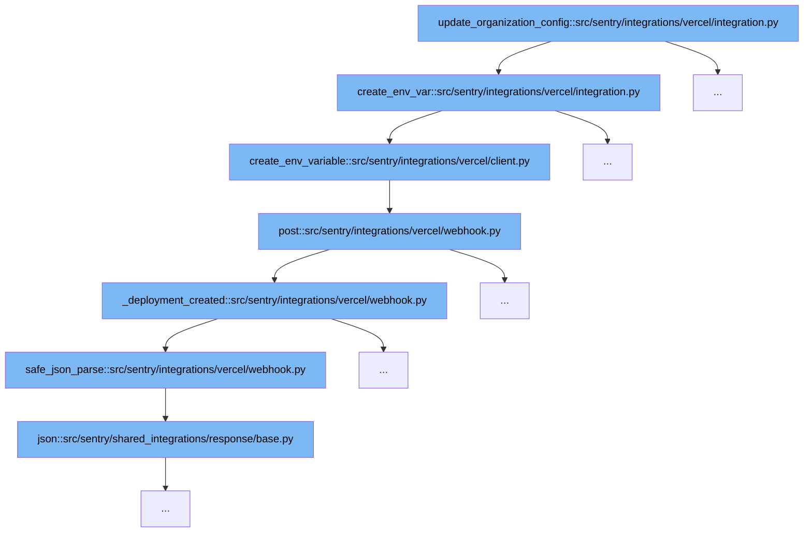

This document will explore the function `update_organization_config` within the Vercel integration in Sentry, detailing the flow of environment variable configuration for a Vercel project. We'll cover:

1. The initiation of environment variable configuration.
2. The creation of a new environment variable.
3. Handling the deployment-related webhook events.



<SwmSnippet path="/src/sentry/integrations/vercel/integration.py" line="270">

---

# Initiation of Environment Variable Configuration

The function `update_organization_config` initiates the process of configuring environment variables for a Vercel project. It prepares the data and attempts to create a new environment variable by calling `create_env_var`.

```python
    def create_env_var(self, client, vercel_project_id, key, value, type, target):
        data = {
            "key": key,
            "value": value,
            "target": target,
            "type": type,
        }
        try:
            return client.create_env_variable(vercel_project_id, data)
        except ApiError as e:
            if e.json and e.json.get("error", {}).get("code") == "ENV_ALREADY_EXISTS":
                try:
                    return self.update_env_variable(client, vercel_project_id, data)
                except ApiError as e:
                    error_message = (
                        e.json.get("error", {}).get("message")
                        if e.json
                        else f"Could not update environment variable {key}."
                    )
                    raise ValidationError({"project_mappings": [error_message]})
            raise
```

---

</SwmSnippet>

<SwmSnippet path="/src/sentry/integrations/vercel/integration.py" line="270">

---

# Creation of a New Environment Variable

Within the `create_env_var` function, data for the new environment variable is structured and passed to `create_env_variable` of the Vercel client for actual creation. If the variable already exists, it attempts to update it instead.

```python
    def create_env_var(self, client, vercel_project_id, key, value, type, target):
        data = {
            "key": key,
            "value": value,
            "target": target,
            "type": type,
        }
        try:
            return client.create_env_variable(vercel_project_id, data)
        except ApiError as e:
            if e.json and e.json.get("error", {}).get("code") == "ENV_ALREADY_EXISTS":
                try:
                    return self.update_env_variable(client, vercel_project_id, data)
                except ApiError as e:
                    error_message = (
                        e.json.get("error", {}).get("message")
                        if e.json
                        else f"Could not update environment variable {key}."
                    )
                    raise ValidationError({"project_mappings": [error_message]})
            raise
```

---

</SwmSnippet>

<SwmSnippet path="/src/sentry/integrations/vercel/webhook.py" line="155">

---

# Handling Deployment-Related Webhook Events

The `post` function in `webhook.py` handles incoming webhook requests. For deployment creation events, it calls `_deployment_created`, which processes the deployment and potentially updates Sentry's release information based on the deployment data.

```python
    def post(self, request: Request) -> Response | None:
        if not request.META.get("HTTP_X_VERCEL_SIGNATURE"):
            logger.error("vercel.webhook.missing-signature")
            return self.respond(status=401)
        is_valid = verify_signature(request)
        if not is_valid:
            logger.error("vercel.webhook.invalid-signature")
            return self.respond(status=401)

        # Vercel's webhook allows you to subscribe to different events,
        # denoted by the `type` attribute. We currently subscribe to:
        #     * integration-configuration.removed (Configuration Removed)
        #     * deployment.created (Deployment Created)
        # https://vercel.com/docs/integrations/webhooks-overview
        try:
            event_type = request.data["type"]
        except KeyError:
            return self.respond({"detail": "Missing event type."}, status=400)

        external_id = self.parse_external_id(request)
        if event_type == "integration-configuration.removed":
```

---

</SwmSnippet>

&nbsp;

*This is an auto-generated document by Swimm AI 🌊 and has not yet been verified by a human*

<SwmMeta version="3.0.0" repo-id="Z2l0aHViJTNBJTNBc2VudHJ5JTNBJTNBZ2V0c2VudHJ5" repo-name="sentry"><sup>Powered by [Swimm](/)</sup></SwmMeta>
