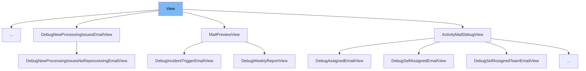

This document will cover the `View` class used in Sentry's codebase, specifically within the `static/app/components/events/interfaces/generic.tsx` file. We'll explore:

1. What `View` is and its purpose.
2. The variables and functions defined within the `View` class.
3. How `View` is utilized in a practical example.

# What is View

In Sentry's codebase, `View` is a TypeScript type used to manage the display modes of event data within the user interface. It can take values 'report' or 'raw', determining how data is rendered in the UI. This type is crucial for toggling between different data views in the event interface, enhancing the user's ability to interpret and analyze the data presented.

&nbsp;

*This is an auto-generated document by Swimm AI 🌊 and has not yet been verified by a human*

<SwmMeta version="3.0.0" repo-id="Z2l0aHViJTNBJTNBc2VudHJ5JTNBJTNBZ2V0c2VudHJ5" repo-name="sentry">Powered by [Swimm](/)</SwmMeta>
