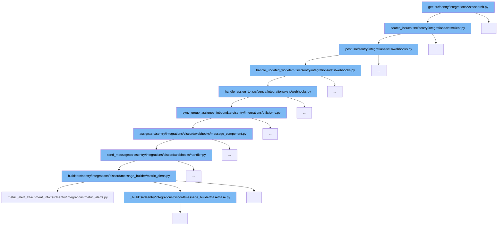

This document will explore the code flow initiated by the `get` function in `src/sentry/integrations/vsts/search.py`, detailing each step and its purpose within the flow:



<SwmSnippet path="/src/sentry/integrations/vsts/search.py" line="1">

---

# Initiating Search

The `get` function in `src/sentry/integrations/vsts/search.py` initiates the flow by calling `search_issues` to search for issues in VSTS.

```python
from typing import Any
```

---

</SwmSnippet>

<SwmSnippet path="/src/sentry/integrations/vsts/client.py" line="415">

---

# Searching Issues

The `search_issues` function constructs a request to the VSTS API to search for work items based on a query, which is a part of handling VSTS integration within Sentry.

```python
    def search_issues(self, account_name: str, query: str | None = None) -> Response:
        return self.post(
            VstsApiPath.work_item_search.format(account_name=account_name),
            data={"searchText": query, "$top": 1000},
            api_preview=True,
        )
```

---

</SwmSnippet>

<SwmSnippet path="/src/sentry/integrations/vsts/webhooks.py" line="43">

---

# Posting to Webhooks

The `post` function handles the webhook response, checking for the event type and handling updated work items accordingly.

```python
    def post(self, request: Request, *args: Any, **kwargs: Any) -> Response:
        try:
            data = request.data
            event_type = data["eventType"]
            external_id = get_vsts_external_id(data=request.data)
        except Exception as e:
            logger.info("vsts.invalid-webhook-payload", extra={"error": str(e)})
            return self.respond(status=status.HTTP_400_BAD_REQUEST)

        # https://docs.microsoft.com/en-us/azure/devops/service-hooks/events?view=azure-devops#workitem.updated
        if event_type == "workitem.updated":
            integration = integration_service.get_integration(
                provider=PROVIDER_KEY, external_id=external_id
            )
            if integration is None:
                logger.info(
                    "vsts.integration-in-webhook-payload-does-not-exist",
                    extra={"external_id": external_id, "event_type": event_type},
                )
                return self.respond(
                    {"detail": "Integration does not exist."}, status=status.HTTP_400_BAD_REQUEST
```

---

</SwmSnippet>

<SwmSnippet path="/src/sentry/integrations/vsts/webhooks.py" line="151">

---

# Handling Updated Work Items

This function processes the updated work items, checking for assignment changes and status updates, which triggers further actions.

```python
def handle_updated_workitem(data: Mapping[str, Any], integration: RpcIntegration) -> None:
    project: str | None = None
    try:
        external_issue_key = data["resource"]["workItemId"]
    except KeyError as e:
        logger.info(
            "vsts.updating-workitem-does-not-have-necessary-information",
            extra={"error": str(e), "integration_id": integration.id},
        )
        return

    try:
        project = data["resourceContainers"]["project"]["id"]
    except KeyError as e:
        logger.info(
            "vsts.updating-workitem-does-not-have-necessary-information",
            extra={"error": str(e), "integration_id": integration.id},
        )

    try:
        assigned_to = data["resource"]["fields"].get("System.AssignedTo")
```

---

</SwmSnippet>

<SwmSnippet path="/src/sentry/integrations/utils/sync.py" line="64">

---

# Syncing Group Assignee

The `sync_group_assignee_inbound` function syncs the Sentry group assignee based on the VSTS work item assignment, ensuring that the Sentry issue assignee reflects the current state in VSTS.

```python
def sync_group_assignee_inbound(
    integration: RpcIntegration,
    email: str | None,
    external_issue_key: str,
    assign: bool = True,
) -> Sequence[Group]:
    """
    Given an integration, user email address and an external issue key,
    assign linked groups to matching users. Checks project membership.
    Returns a list of groups that were successfully assigned.
    """

    logger = logging.getLogger(f"sentry.integrations.{integration.provider}")

    orgs_with_sync_enabled = where_should_sync(integration, "inbound_assignee")
    affected_groups = Group.objects.get_groups_by_external_issue(
        integration,
        orgs_with_sync_enabled,
        external_issue_key,
    )
    log_context = {
```

---

</SwmSnippet>

<SwmSnippet path="/src/sentry/integrations/discord/webhooks/message_component.py" line="137">

---

# Assigning in Discord

The `assign` function in the Discord integration updates the group assignment in Discord, reflecting changes made in Sentry and VSTS.

```python
    def assign(self) -> Response:
        assignee = self.request.get_selected_options()[0]

        self.update_group(
            {
                "assignedTo": assignee,
                "integration": ActivityIntegration.DISCORD.value,
            }
        )

        logger.info(
            "discord.assign.dialog",
            extra={
                "assignee": assignee,
                "user": self.request.user,
            },
        )

        assert self.request.user is not None

        analytics.record(
```

---

</SwmSnippet>

<SwmSnippet path="/src/sentry/integrations/discord/webhooks/handler.py" line="24">

---

# Sending Discord Messages

This function sends messages to a Discord channel to notify about the assignment updates, using the Discord integration.

```python
    def send_message(self, message: str | DiscordMessageBuilder, update: bool = False) -> Response:
        """Sends a new follow up message."""
        response_type = DiscordResponseTypes.UPDATE if update else DiscordResponseTypes.MESSAGE

        if isinstance(message, str):
            message = DiscordMessageBuilder(
                content=message, flags=DiscordMessageFlags().set_ephemeral()
            )
        return Response(
            {
                "type": response_type,
                "data": message.build(),
            },
            status=200,
        )
```

---

</SwmSnippet>

<SwmSnippet path="/src/sentry/integrations/discord/message_builder/metric_alerts.py" line="30">

---

# Building Message Content

The `build` function constructs the content of the message to be sent to Discord, including details about the metric alert and its status.

```python
    def build(self, notification_uuid: str | None = None) -> dict[str, object]:
        data = metric_alert_attachment_info(
            self.alert_rule, self.incident, self.new_status, self.metric_value
        )
        url = f"{data['title_link']}&referrer=discord"
        if notification_uuid:
            url += f"&notification_uuid={notification_uuid}"

        embeds = [
            DiscordMessageEmbed(
                title=data["title"],
                url=url,
                description=f"{data['text']}{get_started_at(data['date_started'])}",
                color=LEVEL_TO_COLOR[INCIDENT_COLOR_MAPPING.get(data["status"], "")],
                image=DiscordMessageEmbedImage(url=self.chart_url) if self.chart_url else None,
            )
        ]

        return self._build(embeds=embeds)
```

---

</SwmSnippet>

&nbsp;

*This is an auto-generated document by Swimm AI 🌊 and has not yet been verified by a human*

<SwmMeta version="3.0.0" repo-id="Z2l0aHViJTNBJTNBc2VudHJ5JTNBJTNBZ2V0c2VudHJ5" repo-name="sentry"><sup>Powered by [Swimm](/)</sup></SwmMeta>
