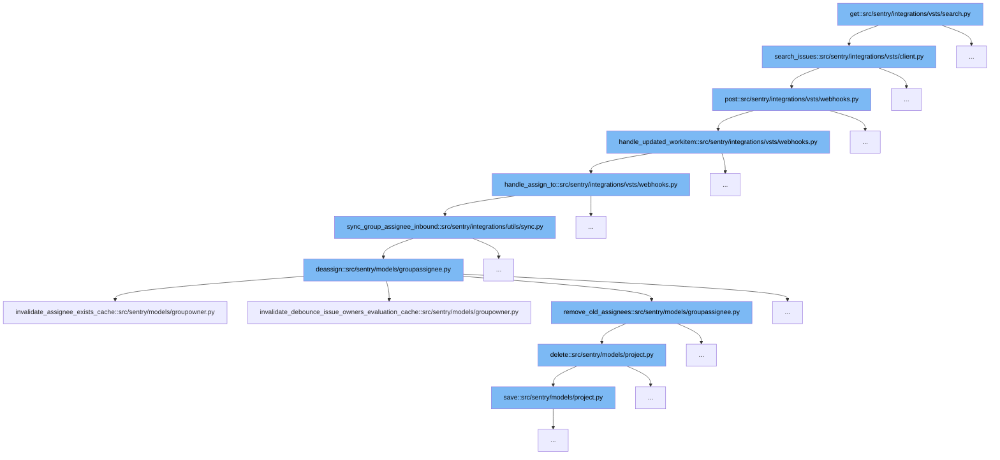

This document will explore the code flow initiated by the function `get` in the file `src/sentry/integrations/vsts/search.py`. We'll cover:

1. The purpose of this code flow.
2. The sequence of function calls and their roles in achieving the flow's goal.



# Purpose of the Code Flow

The code flow starting with the `get` function in `src/sentry/integrations/vsts/search.py` is designed to handle the updating and synchronization of work items from VSTS (Visual Studio Team Services) with Sentry's internal systems. This flow is crucial for maintaining the integrity and up-to-date status of project management tasks within Sentry's ecosystem.

<SwmSnippet path="/src/sentry/integrations/vsts/search.py" line="1">

---

# Function Call Sequence

The `get` function initiates the flow by calling `search_issues` to query VSTS for work items based on specific criteria.

```python
from typing import Any
```

---

</SwmSnippet>

<SwmSnippet path="/src/sentry/integrations/vsts/client.py" line="415">

---

`search_issues` function constructs a query to search for work items in VSTS and sends a POST request using the `post` method.

```python
    def search_issues(self, account_name: str, query: str | None = None) -> Response:
        return self.post(
            VstsApiPath.work_item_search.format(account_name=account_name),
            data={"searchText": query, "$top": 1000},
            api_preview=True,
        )
```

---

</SwmSnippet>

<SwmSnippet path="/src/sentry/integrations/vsts/webhooks.py" line="43">

---

The `post` method handles the response from VSTS. If the event type is 'workitem.updated', it processes the updated work item by calling `handle_updated_workitem`.

```python
    def post(self, request: Request, *args: Any, **kwargs: Any) -> Response:
        try:
            data = request.data
            event_type = data["eventType"]
            external_id = get_vsts_external_id(data=request.data)
        except Exception as e:
            logger.info("vsts.invalid-webhook-payload", extra={"error": str(e)})
            return self.respond(status=status.HTTP_400_BAD_REQUEST)

        # https://docs.microsoft.com/en-us/azure/devops/service-hooks/events?view=azure-devops#workitem.updated
        if event_type == "workitem.updated":
            integration = integration_service.get_integration(
                provider=PROVIDER_KEY, external_id=external_id
            )
            if integration is None:
                logger.info(
                    "vsts.integration-in-webhook-payload-does-not-exist",
                    extra={"external_id": external_id, "event_type": event_type},
                )
                return self.respond(
                    {"detail": "Integration does not exist."}, status=status.HTTP_400_BAD_REQUEST
```

---

</SwmSnippet>

<SwmSnippet path="/src/sentry/integrations/vsts/webhooks.py" line="151">

---

`handle_updated_workitem` checks for assignment updates and status changes, then calls `handle_assign_to` and `handle_status_change` to synchronize these changes with Sentry's systems.

```python
def handle_updated_workitem(data: Mapping[str, Any], integration: RpcIntegration) -> None:
    project: str | None = None
    try:
        external_issue_key = data["resource"]["workItemId"]
    except KeyError as e:
        logger.info(
            "vsts.updating-workitem-does-not-have-necessary-information",
            extra={"error": str(e), "integration_id": integration.id},
        )
        return

    try:
        project = data["resourceContainers"]["project"]["id"]
    except KeyError as e:
        logger.info(
            "vsts.updating-workitem-does-not-have-necessary-information",
            extra={"error": str(e), "integration_id": integration.id},
        )

    try:
        assigned_to = data["resource"]["fields"].get("System.AssignedTo")
```

---

</SwmSnippet>

<SwmSnippet path="/src/sentry/integrations/utils/sync.py" line="64">

---

`sync_group_assignee_inbound` is called to update Sentry's internal records, linking Sentry users to the VSTS work items based on email addresses.

```python
def sync_group_assignee_inbound(
    integration: RpcIntegration,
    email: str | None,
    external_issue_key: str,
    assign: bool = True,
) -> Sequence[Group]:
    """
    Given an integration, user email address and an external issue key,
    assign linked groups to matching users. Checks project membership.
    Returns a list of groups that were successfully assigned.
    """

    logger = logging.getLogger(f"sentry.integrations.{integration.provider}")

    orgs_with_sync_enabled = where_should_sync(integration, "inbound_assignee")
    affected_groups = Group.objects.get_groups_by_external_issue(
        integration,
        orgs_with_sync_enabled,
        external_issue_key,
    )
    log_context = {
```

---

</SwmSnippet>

<SwmSnippet path="/src/sentry/models/groupassignee.py" line="202">

---

The `deassign` function is called to remove any previous assignees from the Sentry group before updating it with new assignee information.

```python
    def deassign(
        self,
        group: Group,
        acting_user: User | RpcUser | None = None,
        assigned_to: Team | RpcUser | None = None,
        extra: dict[str, str] | None = None,
    ) -> None:
        from sentry.integrations.utils import sync_group_assignee_outbound
        from sentry.models.activity import Activity
        from sentry.models.projectownership import ProjectOwnership

        try:
            previous_groupassignee = self.get(group=group)
        except GroupAssignee.DoesNotExist:
            previous_groupassignee = None

        affected = self.filter(group=group)[:1].count()
        self.filter(group=group).delete()

        if affected > 0:
            Activity.objects.create_group_activity(group, ActivityType.UNASSIGNED, user=acting_user)
```

---

</SwmSnippet>

<SwmSnippet path="/src/sentry/models/project.py" line="658">

---

Finally, the `delete` function in the Project model may be called to remove project settings related to the work item, ensuring that all data remains consistent.

```python
    def delete(self, **kwargs):
        # There is no foreign key relationship so we have to manually cascade.
        notifications_service.remove_notification_settings_for_project(project_id=self.id)

        with outbox_context(transaction.atomic(router.db_for_write(Project))):
            Project.outbox_for_update(self.id, self.organization_id).save()
            return super().delete(**kwargs)
```

---

</SwmSnippet>

&nbsp;

*This is an auto-generated document by Swimm AI 🌊 and has not yet been verified by a human*

<SwmMeta version="3.0.0" repo-id="Z2l0aHViJTNBJTNBc2VudHJ5JTNBJTNBZ2V0c2VudHJ5" repo-name="sentry"><sup>Powered by [Swimm](/)</sup></SwmMeta>
