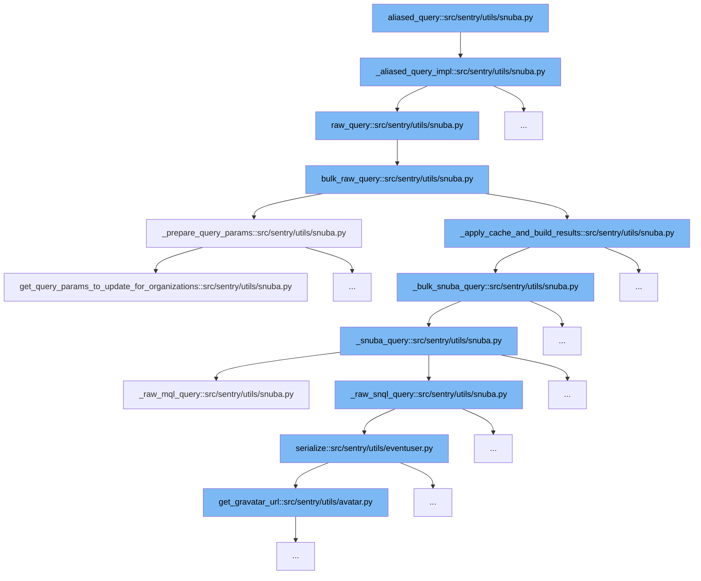

This document will explore the function `aliased_query` and its role in querying data from Snuba in the Sentry codebase. We'll cover:

1. The initiation of the query process.
2. The preparation of query parameters.
3. The execution of the query.



<SwmSnippet path="/src/sentry/utils/snuba.py" line="1335">

---

# Initiation of the Query Process

The `aliased_query` function starts the query process by calling `_aliased_query_impl`, which prepares and executes a raw query to Snuba.

```python
def _aliased_query_impl(**kwargs):
    return raw_query(**aliased_query_params(**kwargs))
```

---

</SwmSnippet>

<SwmSnippet path="/src/sentry/utils/snuba.py" line="670">

---

# Preparation of Query Parameters

The `_prepare_query_params` function is called within the `bulk_raw_query` to prepare and adjust the query parameters based on the dataset and other conditions. This step is crucial for ensuring that the query is correctly formatted and optimized for the Snuba backend.

```python
def _prepare_query_params(query_params: SnubaQueryParams, referrer: str | None = None):
    kwargs = deepcopy(query_params.kwargs)
    query_params_conditions = deepcopy(query_params.conditions)

    with timer("get_snuba_map"):
        forward, reverse = get_snuba_translators(
            query_params.filter_keys, is_grouprelease=query_params.is_grouprelease
        )

    if query_params.dataset in [
        Dataset.Events,
        Dataset.Discover,
        Dataset.Sessions,
        Dataset.Transactions,
        Dataset.Replays,
        Dataset.IssuePlatform,
    ]:
        (organization_id, params_to_update) = get_query_params_to_update_for_projects(
            query_params, with_org=query_params.dataset == Dataset.Sessions
        )
    elif query_params.dataset in [Dataset.Outcomes, Dataset.OutcomesRaw]:
```

---

</SwmSnippet>

<SwmSnippet path="/src/sentry/utils/snuba.py" line="882">

---

# Execution of the Query

The `bulk_raw_query` function executes the prepared queries. It handles multiple queries in bulk, optimizes them for performance, and manages caching and result building through `_apply_cache_and_build_results`.

```python
# TODO: This is the endpoint that accepts legacy (non-SnQL/MQL queries)
# It should eventually be removed
def bulk_raw_query(
    snuba_param_list: Sequence[SnubaQueryParams],
    referrer: str | None = None,
    use_cache: bool | None = False,
) -> ResultSet:
    """
    Used to make queries using the (very) old JSON format for Snuba queries. Queries submitted here
    will be converted to SnQL queries before being sent to Snuba.
    """
    params = [_prepare_query_params(param, referrer) for param in snuba_param_list]
    request_bodies = [
        (json_to_snql(query, query["dataset"]), forward, reverse)
        for query, forward, reverse in params
    ]
    return _apply_cache_and_build_results(request_bodies, referrer=referrer, use_cache=use_cache)
```

---

</SwmSnippet>

&nbsp;

*This is an auto-generated document by Swimm AI 🌊 and has not yet been verified by a human*

<SwmMeta version="3.0.0" repo-id="Z2l0aHViJTNBJTNBc2VudHJ5JTNBJTNBZ2V0c2VudHJ5" repo-name="sentry"><sup>Powered by [Swimm](/)</sup></SwmMeta>
